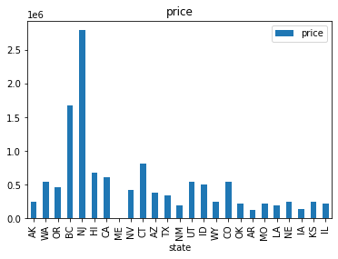
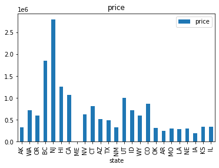
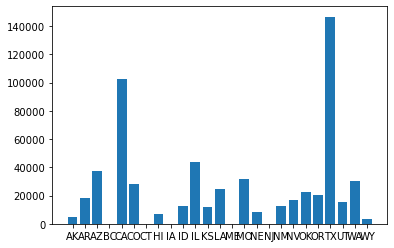
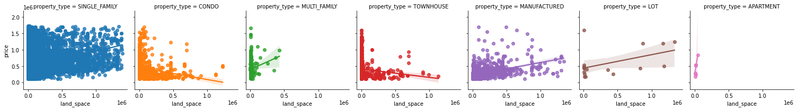
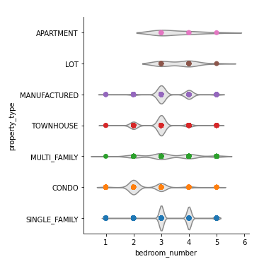
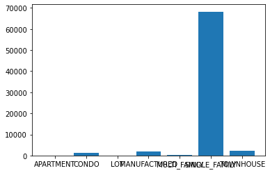
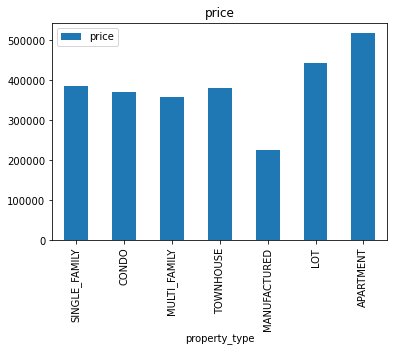
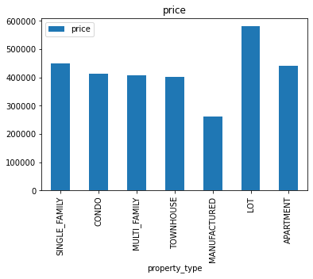
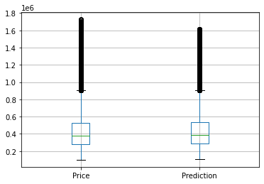
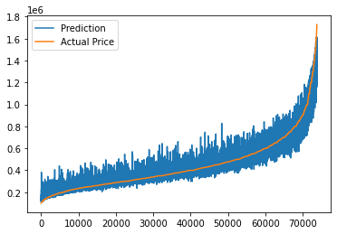

# HOUSE PRICE PREDICTION SYSTEM

## PROBLEM
Real estate is a very important pillar of the economy. However, despite a large amount of data available, we do not have precise measurements of house prices. 
Therefore, this study aims to apply machine learning to predict home selling prices based on various economic indicators.

## INTRODUCTION
The real estate industry is one of the most competitive
in terms of pricing and is always changing. It is one of
the key areas where machine learning concepts are
applied to improve and accurately predict expenses.
Predicting a real estate property's market worth is the
paper's main goal. This approach aids in determining a
property's beginning price depending on geographic
factors. Future costs will be predicted by dissecting past
market trends, price ranges, and upcoming
technological improvements. This examination means to
predict house prices in Texas with Random Forest
regressor . It will help clients to put resources into a
bequest without moving toward a broker. The result of
this research proved that the Random Forest regressor
gives an accuracy of 96.8%.

## DATA
The Data used for this project consists of 600,000
house prices from all over the US, which are listed at
Zillow.com. A large number of dataset samples
makes it a “tall” dataset which will make it possible
to achieve useful predictive accuracy for a wide
range of locations and home types. The first step is
to clean this data and ensure fits for purpose. Then
look at which features would provide interesting
insights and answer questions that would help to
predict the value of a house. Finally, dive into
building a model capable of predicting house prices.

> * [Kaggle Dataset](https://www.kaggle.com/datasets/polartech/500000-us-homes-data-for-sale-properties)

**Exploratory Data Analysis (EDA)**

In the graphic above,
you can see the distribution
of price per unit by each
state
House prices in the state of
California vary widely, but
outliers draw the attention,
but in mid western states
such as Utah, Wyoming, and
Colorado, base prices start
higher
A
more homogeneous
distribution is seen in
southern states such as Texas
and Arizona.

     

You can see the median price chart according to the states in the
left chart, and the average price chart by the states in the right
chart.

It is noticeable that there is no difference between the median
value and the average value in states such as New Jersey and
Connecticut, while in more western states such as Washington,
Oregon, Utah, Idaho, Wyoming, and Colorado the average prices
are significantly higher than the median prices, visible. From this
point of view, we can deduce that there are more high priced
luxury houses in these states, and this drags the average values up.

**Feature Selection**

Since this data set contains
600.000 housing data and 28 columns , I
realized that the problem could not be solved by the computer
after a certain point during feature selection and engineering. In
this context, I decided to establish this price estimation system in
only one state, and I decided on the state of Texas, which is the
state with the most in the data set.

In the graphs above, we can see how the land space and
house prices are related according to the property type
Although there are some exceptions, the conclusion to be
drawn from these charts is that there is a proportional
increase in the price as the land space increases.

This
graph shows the
number of bedrooms in each
property type
The number of bedrooms and
property types are important
features in the model we will
create.
As it can be clearly seen, there
are 3 bedroom properties in the
manufactured, townhouse, and
single family types, while 2
more bedrooms are in the
foreground in condo type
properties.

It is seen how many data
belong to which property type in the state of Texas above.
As expected, we see the same result in our dataset as
there are more single family homes in the state of Texas,
the highlight here is less than 20 data in terms of
apartment and lot.

     

You can see the median price chart according to the
property type in the left chart, and the average price
chart by the property type in the right chart
It is seen that the average price is lower in
townhouses
and apartments. The opposite is true for lots, and the
average lot price is higher than the median lot price, I
think the reason for this is the lots with huge spaces.

**Modeling**

In
my first modeling attempt, I filled the Na (not available)
data with median values, the data of the first model is seen in
the table at the top left.
Once
Na values are filled with zero and the data frame is
expanded with is_na columns, there is a big improvement in
Root Mean Squared Error value and the best model for this
problem seems like the Random Forest model.

When
house prices estimated using the Random Forest regressor
method, the result is as follows
There is a slightly higher median value compared to the actual
prices. However, the main difference is in the outliers, and some
very extreme house prices were found to be much lower prices
When the model is applied to all data prices predicted with an
RMSE value of $43546 and R2 Score of 0.986

The actual prices vs predictions graph is as follows,
as can be seen, the error is more upward oriented at
lower prices, whereas, on the contrary, prices are
predicted lower at higher prices.

**Future Improvements**
* Due to RAM constraints, I had to train just Texas
housing data of the original 600000 house dataset.
Without resource limitations, I would love to train
on the full dataset. Preliminary tests showed that
the bigger the training size, the lower the RMSE.
One test showed an increase in sample size could
increase the RMSE by 0.03.

* With more advanced feature engineering
applications, the score of the model can be further
increased and the RMSE value and margin of error
can be reduced.
