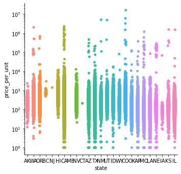

# HOUSE PRICE PREDICTION SYSTEM

## PROBLEM
Real estate is a very important pillar of the economy. However, despite a large amount of data available, we do not have precise measurements of house prices. 
Therefore, this study aims to apply machine learning to predict home selling prices based on various economic indicators.

## INTRODUCTION
The real estate industry is one of the most competitive
in terms of pricing and is always changing. It is one of
the key areas where machine learning concepts are
applied to improve and accurately predict expenses.
Predicting a real estate property's market worth is the
paper's main goal. This approach aids in determining a
property's beginning price depending on geographic
factors. Future costs will be predicted by dissecting past
market trends, price ranges, and upcoming
technological improvements. This examination means to
predict house prices in Texas with Random Forest
regressor . It will help clients to put resources into a
bequest without moving toward a broker. The result of
this research proved that the Random Forest regressor
gives an accuracy of 96.8%.

## DATA
The Data used for this project consists of 600,000
house prices from all over the US, which are listed at
Zillow.com. A large number of dataset samples
makes it a “tall” dataset which will make it possible
to achieve useful predictive accuracy for a wide
range of locations and home types. The first step is
to clean this data and ensure fits for purpose. Then
look at which features would provide interesting
insights and answer questions that would help to
predict the value of a house. Finally, dive into
building a model capable of predicting house prices.

> * [Kaggle Dataset](https://www.kaggle.com/datasets/polartech/500000-us-homes-data-for-sale-properties)

**Exploratory Data Analysis (EDA)**

In the graphic above,
you can see the distribution
of price per unit by each
state
House prices in the state of
California vary widely, but
outliers draw the attention,
but in mid western states
such as Utah, Wyoming, and
Colorado, base prices start
higher
A
more homogeneous
distribution is seen in
southern states such as Texas
and Arizona
